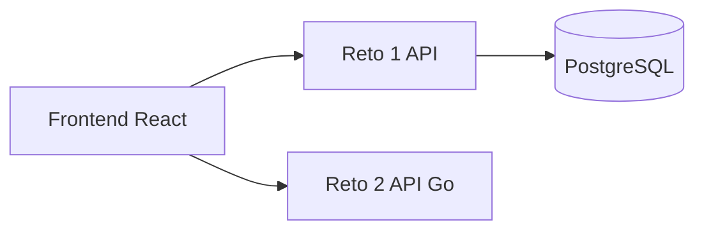
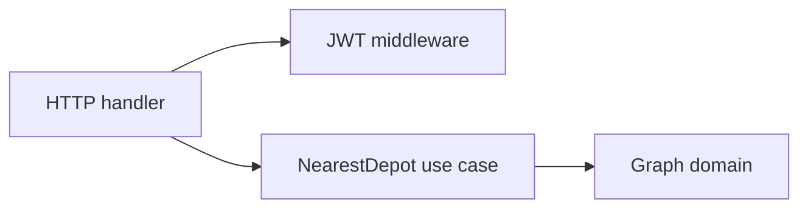

# Reto Tecnico Interseguro

En este repositorio construí dos APIs independientes, una base de datos PostgreSQL, un frontend compartido y un diseño arquitectónico para un tercer reto.



## Como planteé la solucion

Separé cada problema en su propio servicio para mantener responsabilidades claras y facilitar la evolución de cada reto. Además, construí un frontend común para probar los servicios sin mezclar sus implementaciones:

| Componente | Responsabilidad | Tecnologia |
|---|---|---|
| Reto 1 | Transformar un JSON plano de endoso a la estructura del core | Node.js, TypeScript, Hapi, TypeORM |
| Reto 2 | Encontrar el deposito mas cercano usando Dijkstra | Go |
| Persistencia | Guardar productos, plantillas, campos y eventos del reto 1 | PostgreSQL |
| Reto 3 | Diseñar una arquitectura resiliente contra desembolsos duplicados | Mermaid, GCP |
| Frontend | Ejecutar y visualizar las respuestas de ambos retos | React, Vite |

## Reto 1: transformación de endosos

En el primer reto construí una API configurable. La lógica no contiene una lista fija de campos: consulta la plantilla asociada al producto y tipo de endoso, resuelve cada valor desde `payload.*` o `config.*`, respeta el orden configurado y genera la respuesta esperada por el core.

La configuracion se modela con productos, plantillas de endoso, campos de plantilla y eventos aplicados. Cada campo define origen, orden, obligatoriedad y valor por defecto. Esto permite agregar otro producto o tipo de endoso modificando datos de configuracion, sin cambiar el servicio central.

La API ofrece `POST /endorse/translate` y `POST /api/v1/endorse/translate`. Las rutas protegidas requieren JWT Bearer; `GET /health` y `GET /openapi.json` se mantienen publicas para healthchecks y observabilidad.

La persistencia usa PostgreSQL mediante TypeORM. Docker Compose crea la base, espera su healthcheck y ejecuta un seeder idempotente para que los reinicios no dupliquen registros.

Mas detalle: [reto1/README.md](reto1/README.md).

## Reto 2: depósito más cercano

En el segundo reto implementé Dijkstra y organicé el servicio en capas:



Elegí una estructura flexible `map[string]map[string]int`: los distritos son nodos y las distancias son pesos. El grafo se recibe en cada request, por lo que puedo cambiarlo sin modificar el algoritmo.

El caso de uso calcula el camino mínimo desde cada depósito, descarta los que no alcanzan el accidente y devuelve el menor resultado. Si ningún depósito es alcanzable, respondo con un error controlado.

La ruta versionada es `POST /api/v1/routes/nearest-depot`. El modulo Go se llama `reto2`, por eso sus paquetes propios se importan como `reto2/internal/domain` o `reto2/internal/usecase`. La unica dependencia externa relevante es `github.com/golang-jwt/jwt/v5`.

Mas detalle: [reto2/README.md](reto2/README.md).

## Frontend

En el frontend construí un workbench para probar ambos servicios. En [frontend/README.md](frontend/README.md) explico el login automático de desarrollo, la navegación por reto, la integración con ambos APIs, CORS, variables `VITE_*`, Docker y despliegue estático.

## Seguridad

- JWT Bearer en las rutas de negocio.
- Login automatico de desarrollo mediante `POST /api/v1/auth/dev-token`, sin credenciales para facilitar la demostracion local.
- Secretos configurables mediante variables de entorno.
- Imagen Go final distroless y ejecutada como usuario no root.
- CORS configurable.
- En GCP, los secretos deben almacenarse en Secret Manager.

El login automatico solo debe estar habilitado en desarrollo (`ENABLE_DEV_AUTH=true`). En produccion se configura `ENABLE_DEV_AUTH=false` y se utiliza un proveedor de identidad real o un flujo de autenticacion administrado.

## Ejecucion local

Requisito: Docker Desktop iniciado.

```bash
cp .env.example .env
# Cambiar POSTGRES_PASSWORD y JWT_SECRET en .env.
docker compose up --build
```

URLs locales:

- Frontend: `http://localhost:4173`
- Reto 1: `http://localhost:3000`
- Reto 2: `http://localhost:8080`

Tambien se puede usar el `Makefile` como atajo:

```bash
make setup
make up
make test
make down
```

El Makefile no es obligatorio; todos los servicios funcionan directamente con Docker Compose.

## Reto 3: arquitectura de desembolsos

En el tercer reto diseñé una arquitectura TO-BE para evitar desembolsos duplicados cuando INARI responde tarde o devuelve `502`. Propuse `Idempotency-Key`, lock distribuido, cola asíncrona, worker en Cloud Run, reintentos con exponential backoff, estado persistente y notificaciones al frontend.

El diagrama Mermaid, los contratos sugeridos y la explicación de los flujos están en [reto3/README.md](reto3/README.md).

## Pruebas

- Reto 1: transformacion, valores por defecto y validacion de campos requeridos.
- Reto 2: ruta minima y caso no alcanzable.
- Frontend: build TypeScript y Vite.

```bash
make test
```

## Despliegue

Las imagenes estan preparadas para Cloud Run. El flujo recomendado es publicar cada API como un servicio independiente, usar Cloud SQL para PostgreSQL y publicar el frontend en Firebase Hosting o Cloud Storage.

Para automatizar despliegues desde GitHub agregué una configuración de Cloud Build por proyecto:

- [reto1/cloudbuild.yaml](reto1/cloudbuild.yaml): construye y despliega la API Node.js con Cloud SQL y Secret Manager.
- [reto2/cloudbuild.yaml](reto2/cloudbuild.yaml): construye y despliega la API Go en Cloud Run.
- [frontend/cloudbuild.yaml](frontend/cloudbuild.yaml): construye y despliega el frontend en Cloud Run usando las URLs de las APIs.

Al crear los triggers en Cloud Build, usa la rama `main` y estos archivos de configuración:

| Trigger | Archivo | Archivos incluidos |
|---|---|---|
| reto1-deploy | `reto1/cloudbuild.yaml` | `reto1/**` |
| reto2-deploy | `reto2/cloudbuild.yaml` | `reto2/**` |
| frontend-deploy | `frontend/cloudbuild.yaml` | `frontend/**` |

En las sustituciones del trigger de reto 1 debes configurar `_DB_CONNECTION` con el nombre real de Cloud SQL, por ejemplo `PROJECT_ID:us-central1:interseguro-db`. En reto 2 configura `_CORS_ORIGIN` con la URL final del frontend. En frontend configura `_VITE_API_URL` y `_VITE_ROUTE_API_URL` con las URLs de Cloud Run de ambos APIs.

```bash
gcloud builds submit --tag REGION-docker.pkg.dev/PROJECT_ID/interseguro/reto1 ./reto1
gcloud builds submit --tag REGION-docker.pkg.dev/PROJECT_ID/interseguro/reto2 ./reto2
```

Luego se despliega cada imagen en Cloud Run con sus variables de entorno. Reto 1 debe conectarse a Cloud SQL; el volumen PostgreSQL de Compose solo sirve para desarrollo local.
