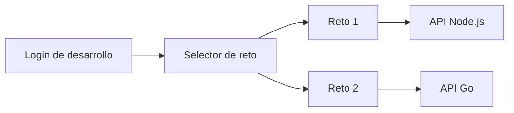

# Frontend: Multi-API Workbench

## Mi solucion

Construí un frontend en React y Vite para probar los dos retos desde una sola interfaz. Decidí mantener la lógica de negocio en cada API y usar el frontend como una herramienta de integración: prepara el JSON, envía la solicitud y muestra la respuesta de forma legible.

## Por qué lo organicé así

El reto 1 y el reto 2 tienen responsabilidades diferentes. Por eso separé la navegación en dos contextos:

- En reto 1 puedo probar la transformación, consultar su OpenAPI y revisar el catálogo de PostgreSQL.
- En reto 2 puedo probar Dijkstra y consultar el OpenAPI específico del servicio Go.

De esta manera cada API tiene su propia sección y el usuario no necesita conocer detalles internos para probarla.

## Arquitectura de la interfaz



La lógica principal está en `src/App.tsx`. Mantengo en el estado el reto seleccionado, la vista activa, el JSON de entrada, la respuesta, los errores y el token de la sesión.

El login inicial solicita un JWT al endpoint de desarrollo `/api/v1/auth/dev-token`. No firmo el token en el navegador: lo genera el backend usando el secreto del entorno y el frontend lo conserva solo en memoria. Esto evita exponer el secreto dentro del cliente.

## Decisiones de experiencia de usuario

Hice obligatorio el login antes de entrar al workbench para que el usuario entienda que está iniciando una sesión de prueba. También agregué generación automática del token si intenta ejecutar una acción protegida sin sesión.

Incluí un editor JSON, formateo, limpieza, copia de respuestas, estados de carga, mensajes de error y un visor expandible de JSON. Para el diagnóstico de cada API agregué healthcheck, rutas disponibles y el documento OpenAPI correspondiente.

## Integración

Las URLs de los servicios se configuran mediante variables Vite:

```env
VITE_API_URL=http://localhost:3000
VITE_ROUTE_API_URL=http://localhost:8080
```

El frontend envía el JWT como `Authorization: Bearer <JWT>`. También contemplé el preflight `OPTIONS` necesario para CORS cuando se envían `Authorization` y `Content-Type`.

## Docker y despliegue

Preparé una imagen en dos etapas: Node genera los archivos estáticos y Nginx los sirve. Así el contenedor final no necesita ejecutar Vite ni instalar dependencias de desarrollo.

Las variables `VITE_*` se incorporan durante el build, por lo que en un despliegue debo reemplazarlas por las URLs de Cloud Run antes de generar la imagen final. Esta estructura permite publicar el frontend en Firebase Hosting, Cloud Storage o Cloud Run.

## Resultado

Con una sola interfaz puedo demostrar los dos retos, verificar sus contratos OpenAPI y visualizar sus respuestas. El frontend queda desacoplado de la implementación interna de cada backend y puede reutilizarse si se agregan nuevos servicios.
