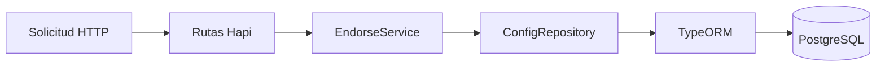

# Reto 1: Transformacion de endosos

## Mi solucion

Construí una API que recibe un JSON plano de endoso y lo transforma en la estructura que consume el core. Decidí basar la transformación en plantillas configurables para que los campos no quedaran escritos directamente en la lógica del servicio.

## Por qué tomé esta decisión

Los productos y tipos de endoso pueden cambiar. Por eso guardé en la base de datos la definición de cada campo: origen, orden, obligatoriedad y valor por defecto. De esta manera, para agregar una nueva variante puedo modificar la configuración y no el código principal.

También separé los valores que vienen del request (`payload.*`) de los valores propios de la configuración (`config.*`). Así la responsabilidad del servicio queda clara y es más sencillo validar cada dato.

## Arquitectura

Organicé la API en rutas, servicio, repositorio y persistencia. `EndorseService` aplica las reglas de transformación; `ConfigRepository` consulta la configuración; TypeORM mantiene la comunicación con PostgreSQL.

La base contiene productos, plantillas, campos y eventos. Implementé un seeder idempotente para que al reiniciar el servicio no se dupliquen los datos iniciales.

## Seguridad y operación

Protegí las operaciones mediante JWT y agregué versionamiento con `/api/v1`. También incorporé healthcheck y OpenAPI para facilitar el monitoreo y la integración con otros consumidores. El login automático existe únicamente para probar el reto en desarrollo y no debe habilitarse en producción.

## Resultado

La respuesta devuelve los datos dinámicos en el orden definido por la plantilla. También validé los casos de valores por defecto y campos requeridos ausentes mediante pruebas unitarias. Elegí PostgreSQL y Docker para que la solución tenga una persistencia real y pueda desplegarse posteriormente en Cloud Run con Cloud SQL.
