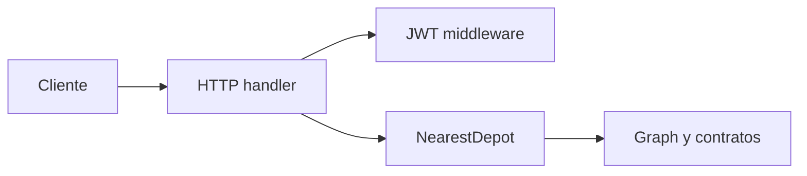

# Reto 2: Deposito mas cercano con Dijkstra

## Mi solucion

Construí una API en Go que recibe un JSON estructurado con la ubicación de un accidente, varios depósitos y un grafo real de distritos con sus distancias. La respuesta indica el depósito alcanzable más cercano, el camino recorrido y la distancia total.

La entrada no es un ejemplo abstracto: el API recibe directamente un objeto JSON como este:

```json
{
  "accidentLocation": "San Isidro",
  "depots": ["Miraflores", "Ate"],
  "graph": {
    "Miraflores": { "San Isidro": 7, "Barranco": 3 },
    "San Isidro": { "Miraflores": 7, "Lince": 4 },
    "Barranco": { "Miraflores": 3, "Surco": 5 },
    "Lince": { "San Isidro": 4, "Surco": 6 },
    "Surco": { "Barranco": 5, "Lince": 6, "Ate": 10 },
    "Ate": { "Surco": 10 }
  }
}
```

## Por qué tomé esta decisión

Ejecuto el algoritmo desde cada depósito, comparo las rutas alcanzables y conservo la de menor distancia.

Representé el grafo como:

```go
type Graph map[string]map[string]int
```

Así los distritos son nodos y las distancias son pesos. El grafo llega en la solicitud, por lo que puedo cambiar la distribución de Lima sin modificar la lógica central. Si ningún depósito alcanza el accidente, devuelvo un error controlado en lugar de una respuesta ambigua.

## Arquitectura por capas



Separé el dominio, el caso de uso, el transporte HTTP y la seguridad. En `internal/usecase` mantengo la lógica de Dijkstra; en `internal/domain` defino los contratos y errores; el handler solo traduce HTTP hacia el caso de uso.

Esta separación me permite cambiar el transporte o la forma de cargar el grafo sin modificar el algoritmo.

## Seguridad y despliegue

Versioné la operación como `POST /api/v1/routes/nearest-depot` y protegí el acceso con JWT. Añadí un login automático solo para desarrollo, así puedo probar la API desde el frontend sin exponer el secreto dentro del navegador.

Empaqueté el servicio en una imagen distroless ejecutada como usuario no root. Elegí esta imagen para reducir la superficie de ataque y dejar el servicio listo para Cloud Run.

## Resultado

Probé la ruta mínima del ejemplo y el caso en el que ningún depósito es alcanzable. La respuesta expone `fromDepot`, `to`, `path` y `distance`, manteniendo un contrato simple para el frontend.
