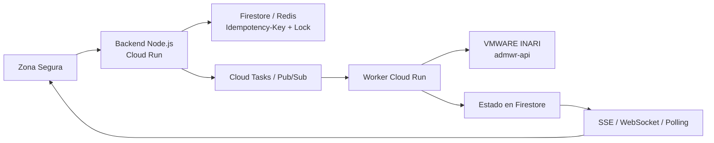

# Reto 3: Arquitectura resiliente para desembolsos

## Mi propuesta

Diseñé una arquitectura TO-BE para evitar desembolsos duplicados cuando `VMWARE INARI` tarda, responde `502` o continúa procesando después de que el proxy informa un error.

Este reto es documental: entregué el diseño de arquitectura y el diagrama porque el objetivo era explicar cómo resolvería el problema antes de construir los servicios.

## Por qué cambié el flujo

El flujo original era sincrónico: el cliente esperaba la respuesta de INARI y, al recibir un `502`, podía presionar nuevamente el botón. Eso permitía que una misma póliza se procesara varias veces.

Por esa razón propuse responder `202 Accepted` rápidamente y mover la comunicación con INARI a un proceso asíncrono. El usuario recibe un `requestId` y puede consultar o recibir el estado de la operación.

## Arquitectura

El diagrama editable está en [arquitectura-desembolsos.drawio](arquitectura-desembolsos.drawio). Lo diseñé con los siguientes componentes:

- Uso `Idempotency-Key` para reconocer reintentos de la misma operación.
- Uso un lock distribuido por póliza o transacción para bloquear solicitudes concurrentes.
- Persisto el estado como `PENDING`, `PROCESSING`, `SUCCEEDED` o `FAILED`.
- Cloud Tasks o Pub/Sub desacopla el backend de la latencia de INARI.
- Un Worker independiente realiza la llamada al sistema legado.
- Los `502` y timeouts activan reintentos con exponential backoff.
- Los errores que superan el máximo de intentos van a una Dead Letter Queue.
- El frontend recibe cambios mediante SSE, WebSocket o polling.

## Decisiones de arquitectura

Elegí servicios administrados de GCP porque permiten escalar sin administrar servidores. Cloud Run ejecuta el backend y el Worker; Firestore o Redis conserva el lock y el estado; Cloud Tasks o Pub/Sub controla la entrega y los reintentos.

La propuesta evita cambios estructurales en INARI, reduce el costo inicial mediante servicios serverless de pago por uso y mejora la trazabilidad al propagar `requestId` e `Idempotency-Key` en todo el flujo.
