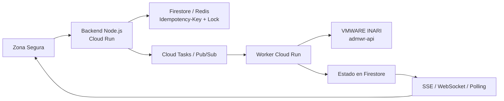

# Reto 3: Arquitectura resiliente para desembolsos

## Mi propuesta

Diseñé una arquitectura TO-BE para evitar desembolsos duplicados cuando `VMWARE INARI` tarda, responde `502` o continúa procesando después de que el proxy informa un error.

Este reto es documental: entregué el diseño de arquitectura y el diagrama porque el objetivo era explicar cómo resolvería el problema antes de construir los servicios.

## Por qué cambié el flujo

El flujo original era sincrónico: el cliente esperaba la respuesta de INARI y, al recibir un `502`, podía presionar nuevamente el botón. Eso permitía que una misma póliza se procesara varias veces.

Por esa razón propuse responder `202 Accepted` rápidamente y mover la comunicación con INARI a un proceso asíncrono. El usuario recibe un `requestId` y puede consultar o recibir el estado de la operación.

## Arquitectura

El diagrama editable está en [arquitectura-desembolsos.drawio](arquitectura-desembolsos.drawio) (también descargable desde el frontend desplegado, en la vista "Reto 3"). Lo diseñé con los siguientes componentes:

- Uso `Idempotency-Key` para reconocer reintentos de la misma operación.
- Uso un lock distribuido por póliza o transacción para bloquear solicitudes concurrentes.
- Persisto el estado como `PENDING`, `PROCESSING`, `SUCCEEDED` o `FAILED`.
- Cloud Tasks o Pub/Sub desacopla el backend de la latencia de INARI.
- Un Worker independiente realiza la llamada al sistema legado.
- Los `502` y timeouts activan reintentos con exponential backoff.
- Los errores que superan el máximo de intentos van a una Dead Letter Queue.
- El frontend recibe cambios mediante SSE, WebSocket o polling.

## Cómo resolví el problema, paso a paso

**1. Evito duplicados con Idempotency-Key + lock distribuido.** El frontend genera una `Idempotency-Key` por intento de desembolso y la envía en cada solicitud. El backend la usa para adquirir un lock por póliza/transacción en Firestore o Redis antes de crear cualquier registro. Si llega una segunda solicitud con la misma clave (por ejemplo, porque el usuario volvió a presionar el botón tras un 502), el backend no crea un nuevo desembolso: devuelve el `requestId` de la solicitud ya existente. Esto elimina la causa raíz del problema original.

**2. Respondo rápido y desacoplo la latencia de INARI.** En vez de esperar la respuesta del sistema legado, el backend valida el JWT, registra el estado `PENDING` y responde `202 Accepted` con el `requestId` en milisegundos. El trabajo real se publica como una tarea en Cloud Tasks o un mensaje en Pub/Sub. Así el proxy nunca alcanza el timeout que producía los `502`, y la disponibilidad del API deja de depender de cuánto tarde INARI.

**3. Reintento con control y una salida para los casos irrecuperables.** Un Worker en Cloud Run, separado del backend, consume la tarea, vuelve a validar la idempotencia (por si dos tareas para la misma clave llegaran a encolarse) y recién ahí llama a INARI (`admwr-api`). Si INARI responde `502` o hay timeout, la cola reintenta automáticamente con backoff exponencial hasta un máximo de intentos configurado. Cuando se agota ese máximo, el evento se mueve a una Dead Letter Queue en vez de perderse, para que el equipo lo revise manualmente sin bloquear el resto del flujo.

**4. Informo el resultado real, no una suposición.** El Worker persiste el estado final (`SUCCEEDED` o `FAILED`) en Firestore junto al `requestId`, actualizando la transición `PENDING → PROCESSING → SUCCEEDED/FAILED`. El frontend se suscribe a esos cambios por SSE o WebSocket (con polling como mecanismo de respaldo si la conexión persistente no está disponible), así el usuario ve el desenlace real del desembolso en vez de asumir que un `202` significa éxito.

**5. Protejo la comunicación con el sistema legado.** Cada solicitud al API exige un JWT válido, igual que en los otros retos. Para que el Worker llegue a INARI —que vive en una red interna— usa un VPC Connector, de modo que INARI nunca queda expuesto a internet y el tráfico entre Cloud Run y el sistema legado se mantiene dentro de la red privada del proyecto.

## Decisiones de arquitectura

Elegí servicios administrados de GCP porque permiten escalar sin administrar servidores. Cloud Run ejecuta el backend y el Worker; Firestore o Redis conserva el lock y el estado; Cloud Tasks o Pub/Sub controla la entrega y los reintentos.

La propuesta evita cambios estructurales en INARI, reduce el costo inicial mediante servicios serverless de pago por uso y mejora la trazabilidad al propagar `requestId` e `Idempotency-Key` en todo el flujo. Al ser 100% asíncrona desde el primer request, tolera que INARI esté lento o intermitente sin degradar la experiencia del usuario ni arriesgar un doble desembolso.
